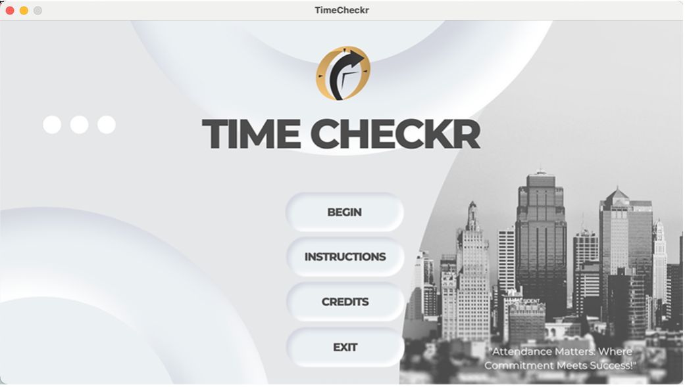

# TimeCheckr 🕒

TimeCheckr is a student attendance and schedule management desktop application built using Java and Swing. It is designed to make attendance checking fast and interactive, while also featuring calendar, timer, alarm, and schedule management functions — all in one unified software tool.

## 🧠 Features

- ✅ **Attendance Checkr**: Toggle each student's presence and get a real-time count of attendees.
- 📅 **Calendar**: Interactive month-view calendar for navigation.
- ⏱️ **Timer**: Session timer with start, pause, and reset.
- ⏰ **Alarm**: Set multiple alarms with snooze and remove options.
- 🗓️ **Time Management**: View classroom or session schedules from Monday to Friday.
- 🎵 **Sound FX**: Click and navigation sounds to improve user experience.

## 📸 Screenshot Preview

## 🚀 Getting Started

1. Clone the repository:

git clone https://github.com/your-username/timecheckr.git
cd timecheckr
Import the project into your preferred Java IDE (NetBeans, IntelliJ, Eclipse).

Make sure all resources are properly linked (images, sounds, etc.).

Run TimeCheckr_Main.java.

👨‍💻 Developer
Sean Carlo G. Flores
BS Computer Engineering
Southern Luzon State University

📄 License
This project is for educational and academic purposes. You may use, distribute, or modify it with proper attribution.
